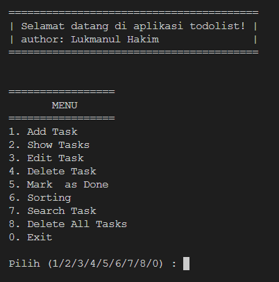
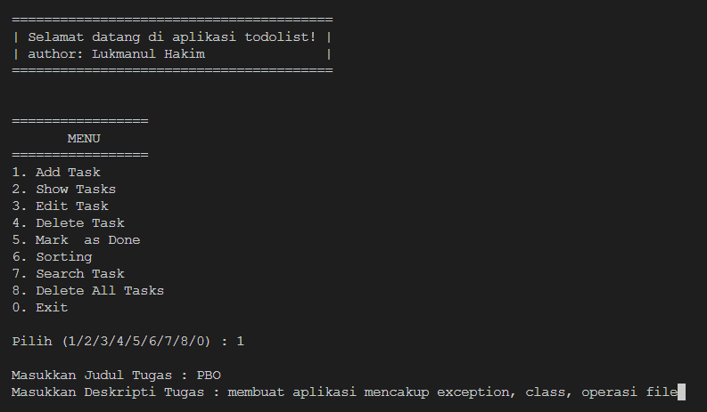
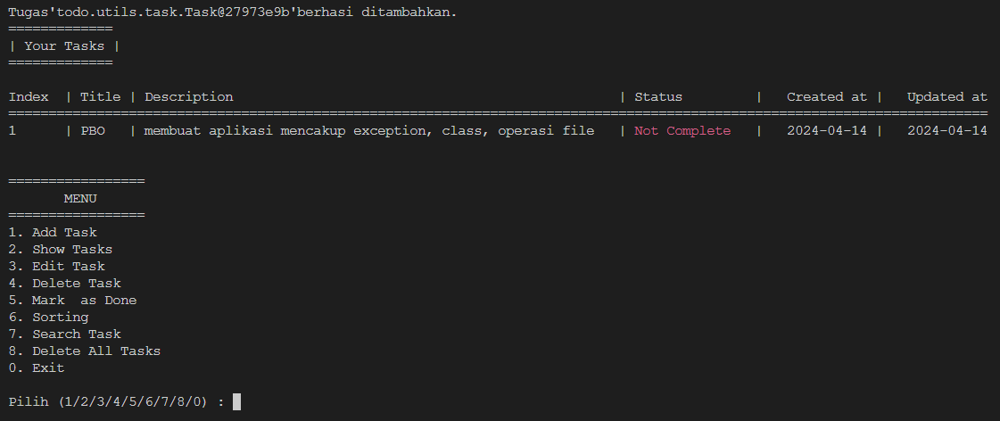
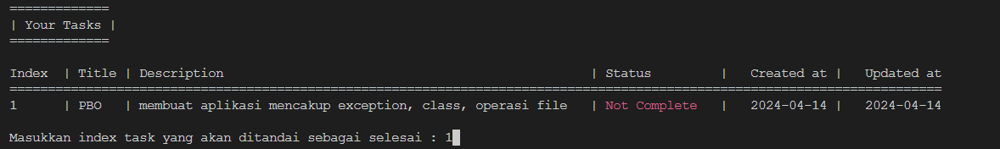
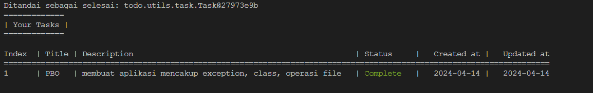
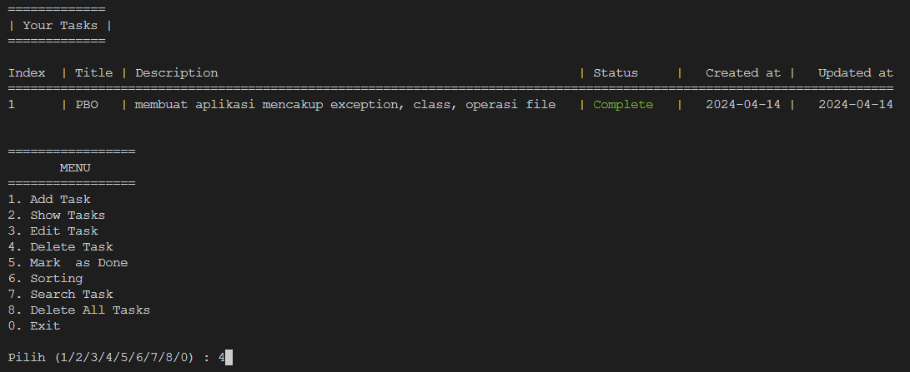
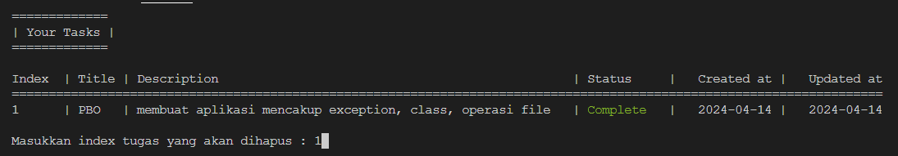
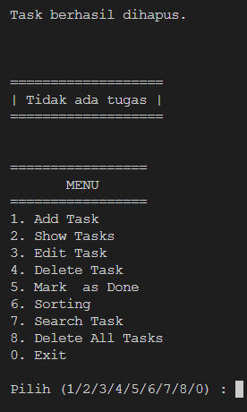

# TODO LIST APP - JAVA
*created by Lukmanul Hakim - giithub.com/78lukman*
## FITUR :
### CRUD 
- Create : Untuk membuat atau menambahkan tugas baru
- Read : Membaca data - data yang sudah ditambahkan tugas (fitur menampilkan data tugas)
- Update : Melakukan update data (untuk melakukan perubahan judul, deskripsi atau menandai tugas sebagai selesai (mark as done))
- Delete : menghapus data tugas yang sudah tidak dibutuhkan

### Save to File
- Jika anda kali pertama menambahkan tugas, program akan membuatkan sebuah file didalam folder list. Semua data tugas anda akan tersimpan di *list/tasks.list*

### Search
- Fitur yang berguna untuk melakukan pencari data tugas berdasasrkan kata kunci yang anda ketikan.

### Sorting / Sort
- Fitur untuk melakukan pengurutan data tugas, baik berdasarkan status (Complete / Not Complete) ataupun berdasarkan tanggal data dibuat (created_at)

### Delete All Tasks
- Fitur untuk menghapus file tasks.list. !semua data tugas akan hilang!

## Preivew
### Intro

### Add Task

### Added Task

### Mark as Done

### 
### 

### Delete Task

### 
### 

### 
### 

## Cara Compile
masuk ke folder todolist-java, kemudian jalankan perintah : 
### linux terminal :
- javac -d . -cp lib/json-simple-1.1.1.jar todo/utils/**/*.java

- javac Main.java

- java -cp lib/json-simple-1.1.1.jar:. Main.java

### windows command prompt:
- javac -cp lib/json-simple-1.1.1.jar todo/utils/task/Task.java todo/utils/manager/TaskManager.java todo/utils/app/App.java

- javac Main.java

- java -cp lib/json-simple-1.1.1.jar;. Main.java

### Catatan : 
kode warna ansi (ansi color) mungkin tidak tidak berjalan dibeberapa terminal.